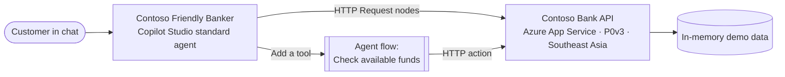

# Contoso Bank — Copilot Studio banking agent lab

Build **Contoso Friendly Banker**, a Microsoft Copilot Studio agent that helps customers check balances, transfer money, pay bills, and buy vouchers. The agent calls a real REST API that you deploy yourself to Azure App Service.

> [!WARNING]
> **Learning use only.** The API uses in-memory mock data and has no real authentication, authorization, fraud controls, or audit trail. Never use it with real customer data or real money.

## What you'll build



The agent has six topics, one for each customer task, and one **agent flow** (a workflow) called **Check available funds**. Every topic that shows a balance or moves money calls the flow before it asks the customer to confirm, so the funds rule lives in one place.

## Lab modules

Work through the modules in order. Each one ends with a **✅ Checkpoint** and a troubleshooting table.

| # | Module | Time | What you'll do |
| --- | --- | --- | --- |
| 1 | [Deploy the banking API](./lab/01-deploy-backend.md) | 20 min | Create a resource group and a P0v3 plan, then deploy from Cloud Shell |
| 2 | [Create the agent](./lab/02-create-agent.md) | 10 min | Create a standard agent, add instructions, and learn the variables |
| 3 | [Demo login and account number](./lab/03-demo-login.md) | 25 min | Build your first HTTP Request node, handle errors, and use global variables |
| 4 | [Balance check workflow](./lab/04-balance-check.md) | 35 min | Build a reusable agent flow that checks funds, then a Balance inquiry topic that calls it |
| 5 | [Transfer money](./lab/05-transfer.md) | 30 min | List saved accounts, check funds with the flow, confirm, and send a POST request |
| 6 | [Pay bills and buy vouchers](./lab/06-bills-and-vouchers.md) | 30 min | Reuse the same pattern for two more journeys |
| 7 | [Test, share, and clean up](./lab/07-test-and-clean-up.md) | 15 min | Run an end-to-end test, reset the data, and delete your resources |

**Total:** about 2 hours 45 minutes.

## Prerequisites

- An Azure subscription where you can create resource groups. The lab uses **Azure Cloud Shell**, so you don't need to install anything locally.
- Access to [Copilot Studio](https://copilotstudio.microsoft.com) in an environment where you can create agents and **agent flows**.
- The environment's data-loss-prevention (DLP) policy must allow the premium **HTTP** connector, which the agent flow in Module 4 uses. Instructors should confirm this with the Power Platform admin before class.
- Basic familiarity with JSON. No coding experience is needed.

## Demo users

| User ID | Account | Owner | Starting balance |
| --- | --- | --- | --- |
| `USER001` | `ACC001` | Chihiro Kimura | USD 5,280.50 |
| `USER002` | `ACC002` | Camila Botelho | USD 1,240.00 |
| `USER003` | `ACC003` | Michelle Caruana | USD 12,400.75 |

IDs aren't case-sensitive, so `user001` works too. Restarting the app resets all balances and bills.

## API reference

The base URL is `https://<your-host>/api`. The full reference with sample responses is at `https://<your-host>/api-docs`.

| Method | Endpoint | Purpose | Used in |
| --- | --- | --- | --- |
| GET | `/login?userId=USER001` | Demo sign-in. No real authentication. | Module 3 |
| GET | `/balance?accountId=ACC001` | Balance inquiry | Module 4 |
| GET | `/saved-accounts?accountId=ACC001` | List saved transfer recipients | Module 5 |
| POST | `/transfer` | Transfer between demo accounts | Module 5 |
| GET | `/bills?accountId=ACC001` | List outstanding bills | Module 6 |
| POST | `/bills/pay` | Pay a selected bill | Module 6 |
| GET | `/vouchers` | List voucher types and amounts | Module 6 |
| POST | `/voucher/purchase` | Buy a voucher | Module 6 |
| GET | `/transactions?accountId=ACC001&limit=10` | Recent transactions | Stretch challenge |

Transfers, bill payments, and voucher purchases reject a request when the balance is too low. Transfers are also limited to USD 10,000 each.

## Run locally (for instructors)

Requires Node.js 22 or later.

```powershell
npm install
npm start
Invoke-RestMethod 'http://localhost:8080/api/login?userId=USER001'
```

Then open `http://localhost:8080/` for the website and `http://localhost:8080/api-docs` for the API reference.

## Microsoft Learn references

- [Make HTTP requests](https://learn.microsoft.com/microsoft-copilot-studio/authoring-http-node)
- [Work with variables](https://learn.microsoft.com/microsoft-copilot-studio/authoring-variables) and [global variables](https://learn.microsoft.com/microsoft-copilot-studio/authoring-variables-bot)
- [Create an agent flow as a tool](https://learn.microsoft.com/microsoft-copilot-studio/advanced-flow-create) and [add an agent flow to an agent](https://learn.microsoft.com/microsoft-copilot-studio/flow-agent)
- [Harnesses in Copilot Studio](https://learn.microsoft.com/microsoft-copilot-studio/harnesses-overview)
- [Deploy a Node.js web app to App Service](https://learn.microsoft.com/azure/app-service/quickstart-nodejs)
- [Configure the Premium v3 tier](https://learn.microsoft.com/azure/app-service/app-service-configure-premium-v3-tier)

## Limitations

The data resets whenever the app restarts or you redeploy it. That's intentional for a classroom. A production banking API would also need persistent storage, real identity and authorization, idempotent transactions, audit logging, secret management, monitoring, and a formal security review.
