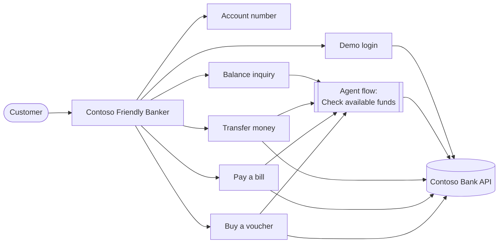

# Module 2 — Create the agent

[← Previous: Deploy the API](./01-deploy-backend.md) · [Lab home](../README.md) · **Module 2 of 7** · [Next: Demo login →](./03-demo-login.md)

| | |
| --- | --- |
| **Time** | 10 minutes |
| **You will** | Create a standard agent, add its instructions, and learn the variables and canvas nodes used in this lab |
| **You need** | Access to Copilot Studio with permission to create agents |

## Why a standard agent, not a declarative agent?

This lab builds conversations with **topics** and the **HTTP Request** node. Both run on the Copilot Studio [standard harness](https://learn.microsoft.com/microsoft-copilot-studio/harnesses-overview). Declarative agents for Microsoft 365 Copilot don't have topics, so the **Topics** page won't appear if you create one of those.

## Step 1 — Create a standard agent

1. Open [Copilot Studio](https://copilotstudio.microsoft.com), and then select the environment your instructor gave you (top-right corner).
2. On the home page, turn **off** the **New experience** toggle. You can also select **Other ways to build** instead.
3. Select **Create** → **New agent**, and then select the **Configure** tab. You don't need the "describe your agent" chat.
4. Enter:
   - **Name**: `Contoso Friendly Banker`
   - **Description**: `Helps Contoso Bank demo customers check balances, transfer money, pay bills, and buy vouchers.`
5. Paste these **Instructions**, and then select **Create**:

```text
You are Contoso Friendly Banker, a friendly assistant for the Contoso Bank classroom demo.

What you can do:
- Sign the customer in with a demo user ID (USER001, USER002 or USER003).
- Tell the customer their account number, show their balance, and list their saved accounts.
- Transfer money to a saved account, pay an outstanding bill, or buy a voucher.

Rules:
- This is a mock bank with no real authentication and no real money. Never ask for passwords, PINs, or card numbers.
- Always use the topics to get account data. Never guess or invent account numbers, balances, bills, transaction IDs, or voucher codes.
- Money moves only after the customer explicitly confirms. Never skip the confirmation step.
- If a topic reports an error, explain it simply and suggest what to do next. Never say a transaction succeeded unless the topic confirmed it.
- Don't give financial, investment, or tax advice. For anything outside these tasks, politely explain what you can help with.

Style: short, warm, and clear. Always show amounts with their currency, for example USD 1,240.00.
```

## Step 2 — Check the agent settings

1. Open **Settings** → **Generative AI**.
2. Confirm that generative **orchestration** is turned on. With it, the agent chooses topics by their **description**, so write descriptions carefully in the next modules.
3. If **Use general knowledge** or **Web search** is on, turn it off. That stops the agent from inventing answers about the bank.
4. Select **Save**.

## How the lab fits together



You'll build one topic per customer journey, plus one **agent flow** (a workflow) called **Check available funds**. Four topics call the flow before they show a balance or move money, so the funds rule lives in one place.

## The variables you'll use

| Variable | Scope | Set in | Holds |
| --- | --- | --- | --- |
| `Global.BaseUrl` | Global | Demo login | The start of every API URL, for example `https://<host>/api` |
| `Global.AccountId` | Global | Demo login | The signed-in demo account, for example `ACC001` |
| `Global.CustomerName` | Global | Demo login | The account holder's name |
| `Global.Currency` | Global | Demo login | The account currency, for example `USD` |
| `Topic.<Name>` | Topic | Any topic | Values that only one topic needs |

> [!IMPORTANT]
> A **topic** variable exists only inside the topic that created it. If another topic needs a value, make it **Global** (select the variable → **Variable properties** → **Global (any topic can access)**).
>
> Agent flows can't read `Global.` variables at all. When a topic calls a flow, it passes values such as `Global.AccountId` in as inputs (you'll do that in Module 4).

## Canvas cheat sheet

Every step in this lab starts with the **+** (**Add node**) icon under an existing node.

| To… | Select **+** → |
| --- | --- |
| Show a message | **Send a message** |
| Ask the customer something | **Ask a question** |
| Branch on a value | **Add a condition** |
| Save or calculate a value | **Variable management** → **Set a variable value** |
| Turn JSON into a record | **Variable management** → **Parse value** |
| Call the API | **Advanced** → **Send HTTP request** |
| Call an agent flow | **Add a tool** → select the flow |
| Run another topic | **Topic management** → **Go to another topic** |
| Stop early | **Topic management** → **End current topic** or **End all topics** |

**Entering a Power Fx formula:** in a message, URL, or value box, select the **{x}** icon, open the **Formula** tab, type the formula, and then select **Insert**. For a condition, open the condition's **…** menu and select **Change to formula**.

### ✅ Checkpoint

- The left navigation shows **Topics** and **Flows**.
- **Settings** → **Generative AI** shows generative orchestration turned on.

## Troubleshooting

| Symptom | Fix |
| --- | --- |
| There's no **Topics** page | You created a new-experience agent or a Microsoft 365 Copilot (declarative) agent. Turn off **New experience** and create the agent again. |
| You can't create agents | Ask your instructor for maker permissions in the environment, or switch to the class environment. |

---

[← Previous: Deploy the API](./01-deploy-backend.md) · [Lab home](../README.md) · [Next: Demo login →](./03-demo-login.md)
