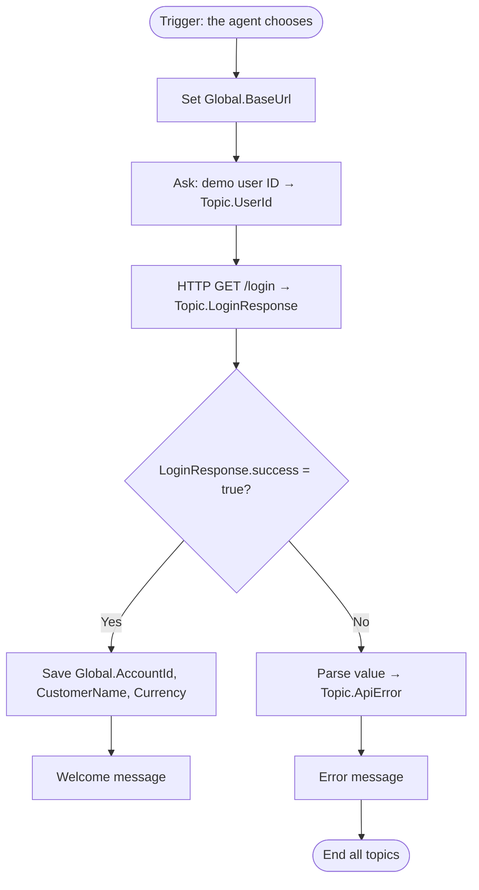

# Module 3 — Demo login and account number

[← Previous: Create the agent](./02-create-agent.md) · [Lab home](../README.md) · **Module 3 of 7** · [Next: Balance check workflow →](./04-balance-check.md)

| | |
| --- | --- |
| **Time** | 25 minutes |
| **You will** | Build your first HTTP Request node, handle API errors, save global variables, and add an account-number topic |
| **You need** | The API base URL from [Module 1](./01-deploy-backend.md#step-6--get-your-api-base-url) |

This module follows the Microsoft Learn tutorial [Make HTTP requests](https://learn.microsoft.com/microsoft-copilot-studio/authoring-http-node).

## What you'll build



## Part A — Demo login topic

### Step 1 — Create the topic

1. Select **Topics** → **+ Add a topic** → **From blank**.
2. Select the topic name at the top of the canvas and rename it `Demo login`.
3. In the **Trigger** node, enter this description. The agent uses it to decide when to run the topic.

   ```text
   Signs the customer in to the Contoso Bank demo with a demo user ID (USER001, USER002 or USER003). Use when the customer wants to log in, start banking, or switch to another demo user.
   ```

   If your agent uses classic orchestration instead, add trigger phrases such as `log me in`, `start banking`, and `switch user`.

### Step 2 — Store the API base URL once

1. Select **+** → **Variable management** → **Set a variable value**.
2. Under **Set variable**, select **Create new**. Select the new variable to open **Variable properties**, rename it `BaseUrl`, and then select **Global (any topic can access)**. It becomes `Global.BaseUrl`.
3. In **To value**, paste your API base URL from Module 1, for example:

   ```text
   https://contoso-bank-nw-12345.azurewebsites.net/api
   ```

   Don't add a slash at the end.

Every banking journey signs in first, so this is the only place you ever need to change the URL.

### Step 3 — Ask for the user ID

1. Select **+** → **Ask a question**.
2. Message: `Which demo user are you? Type USER001, USER002 or USER003.`
3. **Identify**: **User's entire response**.
4. Select the variable and rename it `UserId`.

### Step 4 — Call the login API

1. Select **+** → **Advanced** → **Send HTTP request**.
2. **Method**: `GET`.
3. **URL**: select **{x}** → **Formula**, and enter:

   ```powerfx
   Global.BaseUrl & "/login?userId=" & Trim(Topic.UserId)
   ```

4. **Response data type**: select **From sample data** → **Get schema from sample JSON**, paste the following, and then select **Confirm**:

   ```json
   {
     "success": true,
     "userId": "USER001",
     "accountId": "ACC001",
     "owner": "Chihiro Kimura",
     "currency": "USD",
     "authenticated": false,
     "message": "Demo login only. No real authentication is performed."
   }
   ```

   The schema lets you pick fields like `accountId` from the variable picker later.

5. **Save user response as**: **Create new**, and rename it `LoginResponse`.

Don't add any headers. This classroom API has no authentication.

### Step 5 — Keep the conversation going when the API returns an error

By default, a failed request (for example, HTTP 404 for an unknown user) sends the conversation to the **On Error** system topic, and the customer sees a generic error. Handle it inside the topic instead:

1. On the HTTP node, under **Headers and body**, select **Edit**. The **HTTP Request properties** panel opens.
2. Under **Error handling**, select **Continue on error**.
3. **Status code**: **Create new** → `HttpStatus`.
4. **Error response body**: **Create new** → `HttpErrorBody`.
5. Close the panel.

### Step 6 — Branch on success or failure

1. Select **+** → **Add a condition**. Open the condition's **…** menu, select **Change to formula**, and enter:

   ```powerfx
   Topic.LoginResponse.success = true
   ```

2. Under the **Condition** (success) branch, add three **Set a variable value** nodes. Create each variable as **Global**:

   | Variable | To value (formula) |
   | --- | --- |
   | `Global.AccountId` | `Topic.LoginResponse.accountId` |
   | `Global.CustomerName` | `Topic.LoginResponse.owner` |
   | `Global.Currency` | `Topic.LoginResponse.currency` |

3. Still in the success branch, add **Send a message**. Use **{x}** to insert the variables:

   ```text
   Welcome, {Global.CustomerName}! You're signed in to demo account {Global.AccountId}.
   This is a classroom demo, so no real authentication happened.
   ```

4. Under **All other conditions** (failure), add:
   1. **Variable management** → **Parse value**. Set **Parse value** to `Topic.HttpErrorBody`, set the data type to **From sample data** → **Get schema from sample JSON**, paste the following, and save the result as a new variable named `ApiError`:

      ```json
      { "success": false, "error": "NOT_FOUND", "message": "User USER999 not found." }
      ```

   2. **Send a message**: `Sorry, I couldn't sign you in: {Topic.ApiError.message}`
   3. **Topic management** → **End all topics**.

   **End all topics** matters when another topic sent the customer here. For example, **Transfer money** must stop too if sign-in fails.

5. Select **Save**.

> [!TIP]
> **The error pattern.** You'll reuse Steps 5 and 6 after every HTTP node in this lab:
> 1. Set error handling to **Continue on error** and save to `HttpStatus` and `HttpErrorBody`.
> 2. Add a condition such as `Topic.<Response>.success = true`.
> 3. Under **All other conditions**, parse `HttpErrorBody` into `ApiError`, show `{Topic.ApiError.message}`, and end the topic.
>
> Inside one topic, you can reuse the same `HttpStatus`, `HttpErrorBody`, and `ApiError` variables for every HTTP node.

### Step 7 — Test the topic

Open the **Test** pane and select **Refresh** to start a new conversation. To watch `Global.AccountId` fill in as you go, open the **Variables** panel on the canvas toolbar.

| Type | Expected result |
| --- | --- |
| `log me in`, then `USER001` | *Welcome, Chihiro Kimura! You're signed in to demo account ACC001.* |
| `switch user`, then `user002` | *Welcome, Camila Botelho! … ACC002.* Lowercase IDs work. |
| `log me in`, then `USER999` | *Sorry, I couldn't sign you in: User USER999 not found.* |

## Part B — "What is my account number?" topic

This topic introduces the **sign-in guard**, which you'll copy into every later topic.

1. Create a blank topic named `Account number` with this description:

   ```text
   Tells the signed-in customer their demo account number and account holder name.
   ```

2. Add the sign-in guard:
   1. Select **+** → **Add a condition**. Choose `Global.AccountId` with the operator **is blank**.
   2. Under the **Condition** branch, select **+** → **Topic management** → **Go to another topic** → **Demo login**.
   3. Leave **All other conditions** empty.

3. **Below** the condition, so that it runs after either branch, add **Send a message**:

   ```text
   Your demo account number is {Global.AccountId} ({Global.CustomerName}).
   ```

4. Save and test:

   | Type | Expected result |
   | --- | --- |
   | New conversation → `what's my account number?` | The agent signs you in first, then shows the account number |
   | Ask again in the same conversation | It answers immediately, without asking you to sign in |

When **Demo login** finishes, the conversation returns to **Account number** and continues from the node after the redirect.

### ✅ Checkpoint

- All three demo users sign in successfully, and `USER999` shows a friendly error.
- **Account number** works both before and after sign-in.

## Troubleshooting

| Symptom | Fix |
| --- | --- |
| `accountId` doesn't appear in the variable picker | You skipped **Get schema from sample JSON** in Step 4. |
| "Something unexpected happened" instead of your error message | Error handling is still **Raise an error**. Redo Step 5. |
| HTTP error mentioning an invalid URL | `Global.BaseUrl` is empty or doesn't start with `https://`. Start a new test conversation. |
| HTTP 404, or the error message is `Endpoint not found.` | `Global.BaseUrl` must end with `/api` and must not end with a slash. |
| The agent replies without running your topic | Make the trigger description more specific, and confirm **Web Search** is off ([Module 2](./02-create-agent.md#step-3--check-the-agent-settings)). |

---

[← Previous: Create the agent](./02-create-agent.md) · [Lab home](../README.md) · [Next: Balance check workflow →](./04-balance-check.md)
