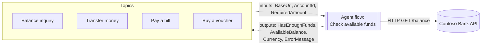

# Module 4 — Balance check workflow (agent flow)

[← Previous: Demo login](./03-demo-login.md) · [Lab home](../README.md) · **Module 4 of 7** · [Next: Transfer money →](./05-transfer.md)

| | |
| --- | --- |
| **Time** | 35 minutes |
| **You will** | Build a reusable **agent flow** that checks available funds, test it, and call it from a Balance inquiry topic |
| **You need** | The **Demo login** topic from [Module 3](./03-demo-login.md). Your environment must allow the premium **HTTP** connector (see [Before you start](#before-you-start)). |

## Why a workflow?

Transfers, bill payments, and voucher purchases all ask the same question: *does the customer have enough money?* That's a business rule, not part of the conversation, so you build it once as an **agent flow** (a workflow) called **Check available funds**. Every topic that moves money calls it.

Microsoft's guidance draws the line this way: topics are optimized for *conversations*, and agent flows are optimized for *business processes* ([Agent flows FAQ](https://learn.microsoft.com/microsoft-copilot-studio/flows-faqs)). A flow also gives you:

- **One place to change the rule.** Later you could add a daily limit or an approval step without editing any topic.
- **Reuse across agents.** Any agent in the environment can call the same flow.
- **Run history.** Every run records its inputs, the API response, and its outputs, which makes debugging easy.



## Before you start

- **The HTTP connector must be allowed.** The flow calls the API with the **HTTP** action, which is a premium connector. Agent flows can use premium connectors, but your tenant's data-loss-prevention (DLP) policy might block HTTP. If you can't add the **HTTP** action in Step 2, ask your instructor or Power Platform admin.
- **Flows can't read `Global.` variables.** Topics pass `BaseUrl` and `AccountId` to the flow as inputs.
- **Agent flow rules** ([Learn](https://learn.microsoft.com/microsoft-copilot-studio/flow-agent)):
  - The flow must use the **When an agent calls the flow** trigger and the **Respond to the agent** action.
  - It must be **published** before a topic can call it.
  - It must respond within **100 seconds**.
  - Every **Respond to the agent** action must return the same outputs.
- **Cost:** agent flow actions cost 13 Copilot Credits per 100 actions ([billing rates](https://learn.microsoft.com/microsoft-copilot-studio/requirements-messages-management#copilot-credits-billing-rates)). This flow runs about 4 actions per check. Testing in the flow designer is free.

## Part A — Build the flow

### Step 1 — Create the flow and its inputs

1. In Copilot Studio, select **Flows** in the left pane, and then select **New flow** → **Agent flow**. The designer opens with the **When an agent calls the flow** trigger and a **Respond to the agent** action already in place.
2. Select the trigger card, and then add three inputs:

   | Type | Name | Example value for testing |
   | --- | --- | --- |
   | Text | `BaseUrl` | `https://<your-host>/api` |
   | Text | `AccountId` | `ACC001` |
   | Number | `RequiredAmount` | `100` |

3. Select **Save draft**, and name the flow `Check available funds`.

### Step 2 — Call the balance API

1. Below the trigger, select **Insert a new action** (**+**), search for **HTTP**, and select the **HTTP** action. Keep its name as **HTTP**, because the expressions below refer to it.
2. Set:
   - **Method**: `GET`
   - **URI**: select `BaseUrl` from **Dynamic content**, type `/balance?accountId=`, and then select `AccountId`.

### Step 3 — Continue even when the API returns an error

When the API returns an error such as 404, the **HTTP** action fails, and by default every action after it is skipped. The topic would then wait until the call times out. Make the next step run either way:

1. Below **HTTP**, add a **Condition** action.
2. Open the condition's **Settings** tab. Under **Run after**, select **Is successful**, **Has failed**, and **Has timed out**.
3. Set the condition to check the status code:
   - Left side: select **Expression**, and enter:

     ```text
     outputs('HTTP')?['statusCode']
     ```

   - Operator: **is equal to**.
   - Right side: select **Expression** again, and enter `200`. If you type `200` as plain text, the condition compares a number with text and always takes the **False** branch.

### Step 4 — Success branch: calculate and respond

In the **True** branch:

1. Add **Parse JSON**. Set **Content** to the **Body** of the **HTTP** action. Select **Use sample payload to generate schema**, paste the following, and then select **Done**:

   ```json
   {
     "success": true,
     "accountId": "ACC001",
     "owner": "Chihiro Kimura",
     "balance": 5280.5,
     "currency": "USD",
     "asOf": "2026-09-28T09:00:00.000Z"
   }
   ```

2. Move the existing **Respond to the agent** action into the **True** branch. If you can't move it, delete it and add a new one there. Add four outputs:

   | Type | Name | Value |
   | --- | --- | --- |
   | Yes/No | `HasEnoughFunds` | Expression (see below) |
   | Number | `AvailableBalance` | Dynamic content: **balance** (from Parse JSON) |
   | Text | `Currency` | Dynamic content: **currency** (from Parse JSON) |
   | Text | `ErrorMessage` | Leave empty |

   For `HasEnoughFunds`, open the expression editor, type `greaterOrEquals(`, pick **balance** from **Dynamic content**, type `, `, pick **RequiredAmount**, and then type `)`. The finished expression looks similar to this:

   ```text
   greaterOrEquals(body('Parse_JSON')?['balance'], triggerBody()?['number'])
   ```

   Picking the values is safer than typing, because the name of the trigger input (`number` here) depends on the order you created the inputs.

### Step 5 — Failure branch: respond with the error

In the **False** branch, add another **Respond to the agent** action with the **same four outputs**:

| Type | Name | Value |
| --- | --- | --- |
| Yes/No | `HasEnoughFunds` | Expression: `false` |
| Number | `AvailableBalance` | Expression: `0` |
| Text | `Currency` | Leave empty |
| Text | `ErrorMessage` | Expression: `coalesce(body('HTTP')?['message'], 'The banking service did not respond. Please try again.')` |

`body('HTTP')?['message']` is the error message returned by the API, for example *Account ACC999 not found.*

### Step 6 — Check settings and publish

1. Open each **Respond to the agent** action, go to **Settings** → **Networking**, and confirm **Asynchronous response** is **Off**.
2. Optional: if the trigger card shows an **Express mode** toggle, turn it on to make runs faster. Express mode is in preview and only available in upgraded environments.
3. Select **Flow checker** and fix any errors shown.
4. Select **Publish**.

The finished flow looks like this:

```text
When an agent calls the flow  (BaseUrl, AccountId, RequiredAmount)
└─ HTTP  GET {BaseUrl}/balance?accountId={AccountId}
└─ Condition  statusCode = 200   [run after: successful, failed, or timed out]
   ├─ True:  Parse JSON → Respond to the agent (HasEnoughFunds = balance ≥ RequiredAmount, …)
   └─ False: Respond to the agent (HasEnoughFunds = false, ErrorMessage = API message)
```

## Part B — Test the flow on its own

1. In the designer, select **Test** → **Manually** → **Test**.
2. Enter the inputs, and then select **Run flow**. Check the outputs for each row:

   | BaseUrl | AccountId | RequiredAmount | Expected outputs |
   | --- | --- | --- | --- |
   | your API base URL | `ACC001` | `100` | `HasEnoughFunds` = true, `AvailableBalance` = 5280.5 |
   | your API base URL | `ACC002` | `5000` | `HasEnoughFunds` = false, `AvailableBalance` = 1240 |
   | your API base URL | `ACC999` | `10` | `HasEnoughFunds` = false, `ErrorMessage` = *Account ACC999 not found.* |

3. Select each action in the completed run to see its exact inputs and outputs. This is the run history you'll use for debugging in later modules.

## Part C — Balance inquiry topic

This topic is the first one to call the flow. Modules 5 and 6 use the same steps.

### Step 1 — Create the topic and add the sign-in guard

1. Create a blank topic named `Balance inquiry` with this description:

   ```text
   Shows the signed-in customer's current account balance. Use when the customer asks how much money they have or wants to check their balance.
   ```

2. Add the sign-in guard from [Module 3, Part B](./03-demo-login.md#part-b--what-is-my-account-number-topic): a condition `Global.AccountId` **is blank** → **Go to another topic** → **Demo login**.

   The flow can't sign the customer in, so every topic that calls it needs this guard first.

### Step 2 — Call the flow

1. Below the condition, select **+** → **Add a tool**, and then select **Check available funds**. An **Action** node appears.

   If the flow isn't listed, it isn't published yet. Go back to [Part A, Step 6](#step-6--check-settings-and-publish).

2. Map the inputs:

   | Flow input | Value |
   | --- | --- |
   | `BaseUrl` | `Global.BaseUrl` |
   | `AccountId` | `Global.AccountId` |
   | `RequiredAmount` | `0` |

   `RequiredAmount` is `0` because this topic only reads the balance.

3. Save the outputs to new topic variables:

   | Flow output | Topic variable |
   | --- | --- |
   | `HasEnoughFunds` | `HasEnoughFunds` |
   | `AvailableBalance` | `AvailableBalance` |
   | `Currency` | `Currency` |
   | `ErrorMessage` | `FundsError` |

### Step 3 — Handle errors, then show the balance

1. Add a condition formula:

   ```powerfx
   !IsBlank(Topic.FundsError)
   ```

   Under that branch, add **Send a message** `Sorry, I couldn't check your balance: {Topic.FundsError}`, and then **End current topic**.

2. Below the condition, add **Send a message** with this formula:

   ```powerfx
   "Your available balance is " & Topic.Currency & " " & Text(Topic.AvailableBalance, "#,##0.00") & "."
   ```

3. Save and test:

   | Type | Expected result |
   | --- | --- |
   | New conversation → `what's my balance?` | Demo login runs first, then *Your available balance is USD 5,280.50.* |
   | `how much money do I have?` | Answers immediately with the same balance |

4. Open **Flows** → **Check available funds** → **Run history**. Each question you asked appears as a run.

> [!TIP]
> **The funds-check pattern.** Every topic that moves money repeats Part C, Steps 2 and 3:
> 1. **Add a tool** → **Check available funds**, with inputs `Global.BaseUrl`, `Global.AccountId`, and the amount.
> 2. If `Topic.FundsError` isn't blank, show it and end the topic.
> 3. If `Topic.HasEnoughFunds = false`, explain the shortfall and end the topic.
>
> You'll use this in [Module 5, Step 6](./05-transfer.md#step-6--check-funds-with-the-workflow) and in Module 6.

### ✅ Checkpoint

- The flow test returns the expected outputs for all three rows in Part B.
- **Balance inquiry** shows the correct balance for all three demo users.
- The flow's **Run history** shows one run for each balance question.

## Troubleshooting

| Symptom | Fix |
| --- | --- |
| The **HTTP** action isn't available, or publishing reports a DLP violation | Your environment's DLP policy blocks the HTTP connector. Ask your admin to allow it in the lab environment. |
| The flow doesn't appear under **Add a tool** | It isn't published, or it's missing the agent trigger or **Respond to the agent** action. |
| The topic waits, then shows a timeout | The **False** branch has no **Respond to the agent** action, or the condition's **Run after** doesn't include **Has failed**. |
| "Outputs don't match" when publishing | Both **Respond to the agent** actions need the same four outputs, with the same names and types. |
| The `HasEnoughFunds` expression shows an error | Rebuild it by picking **balance** and **RequiredAmount** from **Dynamic content** (Part A, Step 4). |
| `body('HTTP')` or `body('Parse_JSON')` isn't found | You renamed an action. Use the new name with spaces replaced by underscores, for example `body('Get_balance')`. |
| Every check says *Account … not found* | The topic passed an empty `AccountId`. Make sure the sign-in guard comes before the **Action** node. |
| The balance is higher or lower than expected | Earlier tests changed it. Reset the data with `az webapp restart` ([Module 1](./01-deploy-backend.md#troubleshooting)). |

---

[← Previous: Demo login](./03-demo-login.md) · [Lab home](../README.md) · [Next: Transfer money →](./05-transfer.md)
