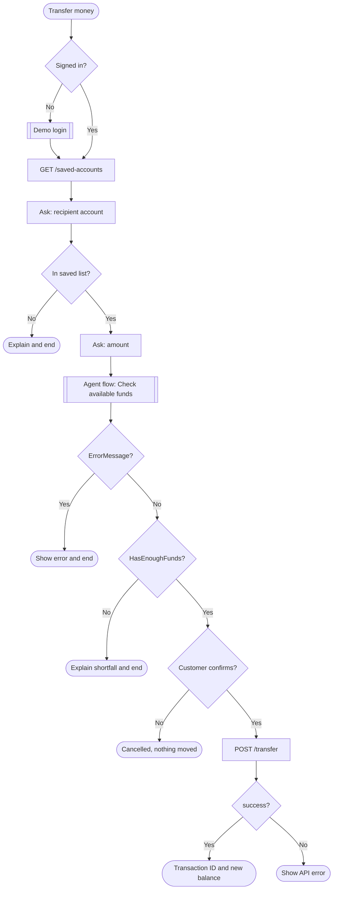

# Module 5 — Transfer money

[← Previous: Balance check workflow](./04-balance-check.md) · [Lab home](../README.md) · **Module 5 of 7** · [Next: Bills and vouchers →](./06-bills-and-vouchers.md)

| | |
| --- | --- |
| **Time** | 30 minutes |
| **You will** | List saved accounts, collect an amount, call the funds-check workflow, ask for confirmation, and send a POST request |
| **You need** | The **Demo login** topic and the **Check available funds** flow from Modules 3 and 4 |

## What you'll build



Money moves only at the **POST /transfer** step, and only after the funds check and an explicit **Yes**.

## Step 1 — Create the topic and add the sign-in guard

1. Create a blank topic named `Transfer money` with this description:

   ```text
   Transfers money from the signed-in customer's account to one of their saved accounts. Use when the customer wants to send or transfer money to another person or account.
   ```

2. Add the sign-in guard from [Module 3, Part B](./03-demo-login.md#part-b--what-is-my-account-number-topic).

## Step 2 — Get the saved accounts

1. Select **+** → **Advanced** → **Send HTTP request**, and use **Method** `GET` with this **URL** formula:

   ```powerfx
   Global.BaseUrl & "/saved-accounts?accountId=" & Global.AccountId
   ```

2. Get the schema from this sample JSON, and save the response as `SavedAccountsResponse`:

   ```json
   {
     "success": true,
     "accountId": "ACC001",
     "count": 2,
     "savedAccounts": [
       { "accountId": "ACC002", "owner": "Camila Botelho", "currency": "USD", "relationship": "saved-demo-recipient" }
     ]
   }
   ```

3. Apply the [error pattern](./03-demo-login.md#step-6--branch-on-success-or-failure) with the condition `Topic.SavedAccountsResponse.success = true`. Build Steps 3–8 below inside the success branch.

## Step 3 — Show the list and ask for a recipient

1. Add **Send a message** with this formula. `Concat` joins one line per saved account, and `Char(10)` adds a line break.

   ```powerfx
   "Here are your saved accounts:" & Char(10) &
   Concat(
     Topic.SavedAccountsResponse.savedAccounts,
     "- " & accountId & " — " & owner,
     Char(10)
   )
   ```

2. Add **Ask a question**:
   - Message: `Which account should receive the money? Type the account number, for example ACC002.`
   - **Identify**: **User's entire response**
   - Variable: `ToAccountId`

## Step 4 — Check that the recipient is in the list

1. Add **Set a variable value**. Create a new variable named `Recipient`, and set it with this formula:

   ```powerfx
   LookUp(
     Topic.SavedAccountsResponse.savedAccounts,
     accountId = Upper(Trim(Topic.ToAccountId))
   )
   ```

   `Recipient` becomes a record with `accountId` and `owner`, or blank if there's no match.

2. Add a condition formula `IsBlank(Topic.Recipient)`. Under that branch, add:
   - **Send a message**: `That account isn't in your saved list. Please start the transfer again and choose one of the listed accounts.`
   - **End current topic**

## Step 5 — Ask for the amount

Below the condition, add **Ask a question**:

- Message: `How much would you like to send to {Topic.Recipient.owner}?`
- **Identify**: **Number**
- Variable: `TransferAmount`

## Step 6 — Check funds with the workflow

Follow the [funds-check pattern](./04-balance-check.md#step-3--handle-errors-then-show-the-balance) from Module 4:

1. Select **+** → **Add a tool** → **Check available funds**, and map the inputs:

   | Flow input | Value |
   | --- | --- |
   | `BaseUrl` | `Global.BaseUrl` |
   | `AccountId` | `Global.AccountId` |
   | `RequiredAmount` | `Topic.TransferAmount` |

2. Save the outputs to topic variables: `HasEnoughFunds`, `AvailableBalance`, `Currency`, and `FundsError` (from `ErrorMessage`).
3. Add a condition formula `!IsBlank(Topic.FundsError)`. Under that branch, send `Sorry, I couldn't check your balance: {Topic.FundsError}`, and then **End current topic**.
4. Below it, add a condition formula `Topic.HasEnoughFunds = false`. Under that branch, add:
   - **Send a message** (formula):

     ```powerfx
     "Sorry, your balance is " & Topic.Currency & " " & Text(Topic.AvailableBalance, "#,##0.00") &
     ", which isn't enough to send " & Text(Topic.TransferAmount, "#,##0.00") & "."
     ```

   - **End current topic**

This is the same flow **Balance inquiry** calls. The only difference is the amount you pass in.

## Step 7 — Ask for confirmation

1. Add **Ask a question**:
   - Message: `Please confirm: send {Topic.Currency} {Topic.TransferAmount} to {Topic.Recipient.owner} ({Topic.Recipient.accountId})?`
   - **Identify**: **Multiple choice options**
   - Options: `Yes, send it` and `No, cancel`
   - Variable: `ConfirmTransfer`

   Copilot Studio creates one branch for each option automatically.

2. Under the **No, cancel** branch, add:
   - **Send a message**: `OK, I cancelled the transfer. No money was moved.`
   - **End current topic**

## Step 8 — Send the transfer

Under the **Yes, send it** branch:

1. Select **+** → **Advanced** → **Send HTTP request**.
2. **Method**: `POST`. **URL** formula:

   ```powerfx
   Global.BaseUrl & "/transfer"
   ```

3. Under **Headers and body**, select **Edit**. Under **Body**, choose **JSON content**, select **Edit JSON** → **Formula**, and enter:

   ```powerfx
   {
     fromAccountId: Global.AccountId,
     toAccountId: Topic.Recipient.accountId,
     amount: Topic.TransferAmount,
     note: "Sent with Contoso Friendly Banker"
   }
   ```

4. In the same panel, set **Error handling** to **Continue on error**, saving to `HttpStatus` and `HttpErrorBody`.
5. Get the schema from this sample JSON, and save the response as `TransferResponse`:

   ```json
   {
     "success": true,
     "transactionId": "TXN-0006",
     "type": "TRANSFER",
     "amount": 45,
     "currency": "USD",
     "newBalance": 5235.5,
     "timestamp": "2026-09-28T09:00:00.000Z"
   }
   ```

6. Add a condition formula `Topic.TransferResponse.success = true`:
   - Under the success branch, add **Send a message** (formula):

     ```powerfx
     "Done! I sent " & Topic.TransferResponse.currency & " " & Text(Topic.TransferResponse.amount, "#,##0.00") &
     " to " & Topic.Recipient.owner & "." & Char(10) &
     "Transaction ID: " & Topic.TransferResponse.transactionId & Char(10) &
     "New balance: " & Topic.TransferResponse.currency & " " & Text(Topic.TransferResponse.newBalance, "#,##0.00")
     ```

   - Under **All other conditions**, parse `HttpErrorBody` into `ApiError`, then send `Sorry, the transfer failed: {Topic.ApiError.message}`.

7. Save the topic.

The API also checks the balance and a USD 10,000 limit per transfer. The check in Step 6 gives the customer a friendly answer early; the API is the final safety net.

## Step 9 — Test

Start a new test conversation for each row. Sign in as the user shown.

| User | Type | Expected result |
| --- | --- | --- |
| USER001 | `send money` → `ACC002` → `10` → **Yes, send it** | A transaction ID, and a new balance of USD 5,270.50 |
| USER001 | `send money` → `ACC999` | *That account isn't in your saved list…* |
| USER001 | `send money` → `ACC002` → `999999` | *Sorry, your balance is … which isn't enough…* The transfer request is never sent. |
| USER001 | `send money` → `ACC002` → `10` → **No, cancel** | *No money was moved.* Then check with `what's my balance?` |
| USER003 | `send money` → `ACC001` → `11000` → **Yes, send it** | *Sorry, the transfer failed: Single transfer limit is $10,000…* This proves the error path works. |

### ✅ Checkpoint

- A confirmed transfer returns a transaction ID and lowers the balance.
- Cancelling, choosing an unknown account, or not having enough funds never calls `POST /transfer`.
- The API's own error messages reach the customer.

## Troubleshooting

| Symptom | Fix |
| --- | --- |
| `400 fromAccountId, toAccountId, and amount are required` | The body is still **No content**, or the field names in the JSON formula are misspelled. |
| The confirmation question doesn't create branches | **Identify** must be **Multiple choice options**. |
| `Topic.Recipient.owner` isn't offered in the variable picker | Save the topic so Copilot Studio can infer the record type from the `LookUp` formula, and then reopen it. |
| Transfers keep failing with *Insufficient balance* | Earlier tests drained the account. Run `az webapp restart` to reset the data. |
| The funds check always says the balance isn't enough | `RequiredAmount` is mapped to the wrong variable. Open the flow's **Run history** and check the inputs it received. |

---

[← Previous: Balance check workflow](./04-balance-check.md) · [Lab home](../README.md) · [Next: Bills and vouchers →](./06-bills-and-vouchers.md)
